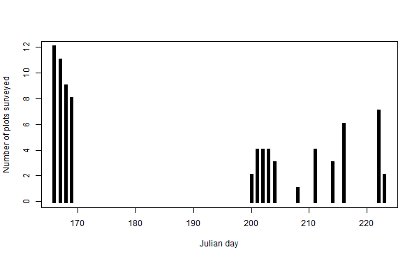

# Materials and Methods

In our detailed presentation of our methods and even our thought process for why methods were chosen, we are seeking to follow the recommendations of @Devarajan_et_al_2020.

## Study area

The study area, described by Bowser et al. [-@Bowser_et_al_2020], was a 938 ha portion of the Slikok Creek watershed on the Kenai National Wildlife Refuge (KNWR) with a bounding box from 60.44° to 60.47° latitude and from -151.10° to -151.03° longitude. 

Based on data from the U.S.\ National Land Cover Database [@Homer_et_al_2015], the land area of this study area was coverd mostly by mixed forest (29%), evergreen forest (22%), emergent herbaceous wetlands (13%), deciduous forest (12%), woody wetlands (11%), and open water (10%). Common trees in well-drained areas were white spruce (*Picea glauca* (Moench) Voss), Alaska birch (*Betula pendula* subsp. *mandshurica* (Regel) Ashburner & McAll.), quaking aspen (*Populus tremuloides* Michx.), and cottonwood (*Populus* × *hastata* Dode). Black spruce (*Picea mariana* Britton, Sterns & Poggenb.) was the dominant tree in forested wetlands. Herbaceous wetlands were characterized by mosses, sedges, and low shrubs. Shallow, eutrophic lakes (Headquarters Lake, Nordic Lake, and smaller, unnamed lakes) accounted for most of the open water in the study area.

This study area was chosen as an analog of a real conservation unit that could be conveniently sampled from our office at the Kenai National Wildlife Refuge, which lies at 60.4647°N, 151.0735°W within the Slikok Creek watershed. Like most conservation units and like the Kenai National Wildlife Refuge as a whole, this study area includes varied habitat types; arbitrary, artificial, and ecologically open boundaries that have no meaning to wildlife; and a range levels of human disturbance from fairly remote, undisturbed areas to developed land.

Sampling design, field methods, and identification methods were detailed by @Bowser_et_al_2020, but they are summarized here.

## Sampling design

We chose a systematic sampling design because of its simplicity and because could be used to obtained unbiased estimates representing the entire study area. A grid with 500 m spacing between points was chosen by using the coordinates of the centroids of the 250 m pixels from the Alaska eMODIS product [@Jenkerson_2010], choosing every other centroid to make a grid of sites having 500 m spacing. The resulting sample frame consisted of 40 terrestrial sites.

## Field methods

Sampling sites were permanently marked by driving 122 cm long, 13 mm diameter SunGUARD Smart Stake™ fibreglass rods into the ground, then labelling them with aluminium tags. During the survey period, sites were also temporarily marked with high-visibility forestry flagging tape.

Sweep net samples of terrestrial arthropods were collected in two sampling periods: from 14 to 17 June 2016 and from from 18 July to 9 August 2016. During each sampling period, two samples were collected at each plot for a total of 160 sweep net samples (40 plots × 2 samples/plot × 2 visits/plot). 

The timing of the first sampling window was determend by concurrent sampling of birds using variable circular plot methods. This meant that all sampling took place in the morning. Two field crews of two people were available for full work days so that all 40 plots could be visited in a short, 4 day time window.

During the second sampling window, invertebrates were sampled concurrently with vegetation sampling. Even though it would have been ideal to complete the second sampling in a short time window, this was not accomplished because only a single, two person crew was available; vegetation sampling took longer than bird surveys; and because other time demands on surveyors' time meant that not every day could be devoted to this project. This resulted in a much longer sampling window of 23 days.

\
Number of plots surveyed per day.

Arthropods were sampled within a 100 m2, 5.64 m radius, circular plot using the center stake as plot center. We split the plot into two semicircular subplots divided along the north-south axis. Each subplot was independently sweep-netted, such that the entire area was swept from the ground surface up to a height of roughly 2 m. No defined pattern of sweeping was enforced, but we ensured that all substrates and macrohabitats within reach were swept once within a time limit of 5 min per sample. We used a BioQuip™ model 7112CP 30.5 cm diameter net with a BioQuip™ model 7312AA 30.5 cm extension handle and a BioQuip™ model 7112CPA net bag with a mesh size of approximately 8 × 9 meshes/mm.

All specimens were collected into a single Nalgene® model 2104-0008 wide-mouth 250 ml bottle containing UniGard -100 propylene glycol antifreeze.

## Laboratory methods

Invertebrates and fragments of invertebrates in the sweep net samples were separated from debris by hand under a stereomicroscope. 

Due to budget limitations, we could only process 125 of the 160 sweep net samples. We considered that there was a trade-off between choosing as many sites as possible, which would be optimal for the inventory objectives of the study to document the occurrence of as many species as possible, and choosing as many samples per site as possible, which would have been better for obtaining estimates of imperfect detection and occupancy. Because we knew so little about the diversity of terrestrial invertebrates that could be encountered, we chose to make documenting as many species as possible our priority over optimization for obtaining occupancy metrics.

We selected all 80 samples taken from the east side of each plot (40 plots × 1 sample/plot × 2 visits/plot). To choose 45 samples from the remaining 80, we selected plots spatially. First, we chose 20 samples from plots at 1 km spacing (10 plots × 2 visits/plot), then we chose 25 of 26 samples from another 13 plots that were maximally distant from these 10 plots (13 plots × 2 visits/plot). These 45 samples from west plot halves were intended to be used for estimating occupancy metrics.

Sweep net samples were shipped to RTL Genomics, Lubbock, Texas (<http://rtlgenomics.com>) for extraction and DNA sequencing steps. For details of sequencing and identifications obtained through a high-throughput sequencing analysis pipeline, see @Bowser_et_al_2020.

## Molecular identifications

Invertebrate sequences that could not be confidently assigned to described species were assigned to BOLD Barcode Index Numbers [BINs, @Ratnasingham_Hebert_2013] if possible. Sequences that could be assigned to neither species nor BINs were given provisional names including labels of the molecular operational taxonomic units [MOTUs, @Blaxter_et_al_2005], e.g. "*Liriomyza* sp. SlikokOtu253". For our purposes we considered all of these entities to be species.

We sought to follow the guidelines of @Penev_et_al_2017 for publication of biodiversity data. Species occurrence data have been made available via Arctos (<https://arctosdb.org/>), where they are associated together via an Arctos project (<http://arctos.database.museum/project/10002227>). These occurrence data on Arctos are also provided to the Global Biodiversity Information Facility (<https://www.gbif.org/>).

In the time since @Bowser_et_al_2020 was published, a handfull of identifications of the records on Arctos have been improved based on new data that became available in the reference databases [@Ratnasingham_Hebert_2007; @Clark_et_al_2016].

A summary of identfications from all HTS occurrences from sweep net samples obtained by @Bowser_et_al_2020 were downloaded from Arctos on 12 November 2020 (saved search URI: <https://arctos.database.museum/saved/2020-11-12-1157_Slikok_metabarcoding_taxa_list>), yielding a list of 975 unique identifications. For unidentified MOTUs where 10 or more occurrences were observed, we attempted to improve identifications by submitting the sequences to BOLD's ID Engine [@Ratnasingham_Hebert_2007] and BLAST [@Altschul_et_al_1990] searches. We obtained no new identifications.

The 2,375 occurrences were downloaded on 12 November 2020 (saved search URI: <https://arctos.database.museum/saved/2020-11-12-1400_Slikok_project_metabarcoding_occurrences>).

## Data analysis

Data processing and analysis was carried out using R version 4.0.2 [@R_Core_Team_2020]; the packages knitr [@Xie2014; @Xie2015; @Xie2020] and reshape [@Wickham_2007], reshape2 [@Wickham_2007], and rjags [@Plummer_2019]; and JAGS version 4.3.0 [@Plummer_2003].

We began with data exploration. Most species were observed in only one sample and most were observed at only a single plot. 

### Occupancy model assumptions

We considered multispecies occupancy model assumptions as presented by @Devarajan_et_al_2020. 

A challenge of applying occupancy models to ephemeral, highly vagile animals like winged insects is that assumptions of geographic and demographic closure can seldom be satisfied. The population sizes of many insects can change rapidly over a short time, for example with aphids. The life stages and abundances of some insects are highly seasonal, in some species with adults appearing over a brief seasonal time window. In addition, many species are winged, phoretic on winged species, or can be wind disperesed by ballooning. These species can move freely into and out of the study area on a time scale of hours and they can move onto or out of plots in a matter of seconds.

We were aware that many species in our study area would be unlikely to be detected within our two temporal sampling windows. For example, the stonefly *Utacapnia columbiana* (Claassen, 1924) is abundant in large, glacial streams of the area. The adults emerge in large numbers in March through May and disperse over our study area, where they can be found on vegetation, but the adults were gone by the time we began sampling on 14 June.

Because our "revisits" at each sampling event were spatial replicates taken within 10 min. of each other, there was some degree of closure between the two revisits. Also, ours were removal methods where individuals collected in one sample would not be available for subsequent sampling, but it seems reasonable that one 50 m2 sweep net sample would not remove enough of the invertebrate population to affect the next sampling event one month or more later.

Because we assume that geographic and geographic closure would not apply to at least many terrestrial invertebrate species, it may be appropriate to use staggered-entry occupancy models [@Kendall_et_al_2013].

### Occupancy models

We first tried running a simple multi-species, multi-season occupancy model provided by @Joseph_2013.

