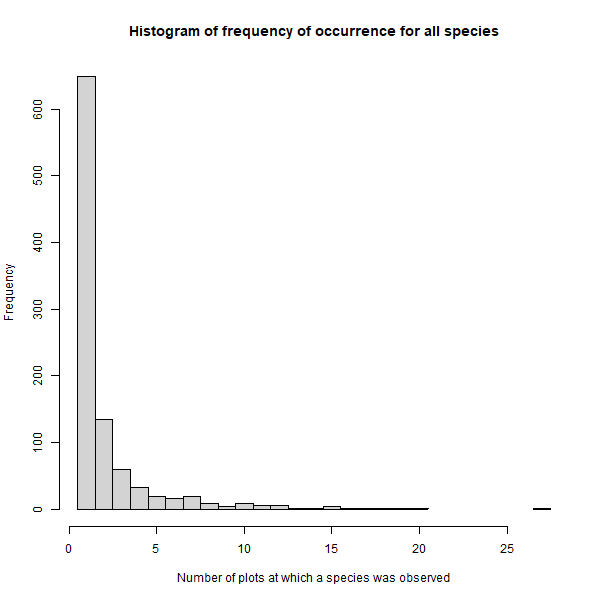

# Results

## Data exploration

Out of the 975 species observed, 615 species (63% of species) were detected in only one of the 125 samples and 649 species (67% of species) were detected at a single plot. The most commonly observed species was the mosquito *Ochlerotatus communis*, observed in 36 samples (29% of samples) and at 27 plots (68% of plots).

\
Histogram of numbers of samples in which each species was observed.

\
Histogram of numbers of plots at which each species was observed.
