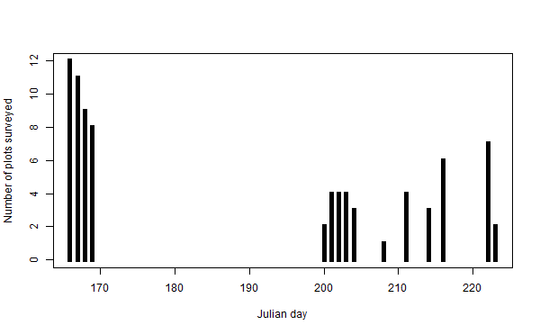

# Data summaries

This output was written by the R script [../../code/01_reshape_data.R>](../../code/01_reshape_data.R).

Number of records: \
2375

Number of unique identifications: \
975

Number of unique species X event records: \
975

Number of records by Julian day
| julian_day| n_observations|
|----------:|--------------:|
|        166|            356|
|        167|            290|
|        168|            212|
|        169|            225|
|        200|             77|
|        201|            153|
|        202|            129|
|        203|             96|
|        204|            164|
|        208|             27|
|        211|             93|
|        214|             67|
|        216|            167|
|        222|            226|
|        223|             93|

\
Numbers of observation records by Julian day.

Number of plots: \
40

Number of plots surveyed per day
| julian_day| n_plots|
|----------:|-------:|
|        166|      12|
|        167|      11|
|        168|       9|
|        169|       8|
|        200|       2|
|        201|       4|
|        202|       4|
|        203|       4|
|        204|       3|
|        208|       1|
|        211|       4|
|        214|       3|
|        216|       6|
|        222|       7|
|        223|       2|

\
Number of plots surveyed per day.

Number of subplots surveyed per day
| julian_day| n_subplots|
|----------:|----------:|
|        166|         18|
|        167|         17|
|        168|         14|
|        169|         14|
|        200|          3|
|        201|          6|
|        202|          6|
|        203|          7|
|        204|          5|
|        208|          2|
|        211|          6|
|        214|          4|
|        216|          9|
|        222|         11|
|        223|          3|

\
Number of subplots surveyed per day.

