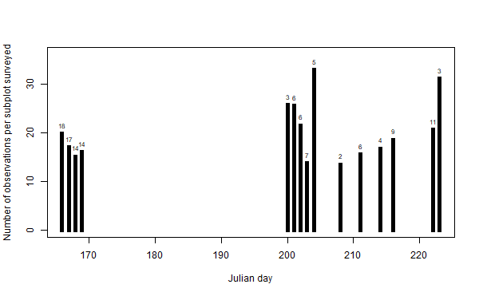

# Data summaries

This output was written by the R script [../../code/01_reshape_data.R](../../code/01_reshape_data.R).

## Sampling summaries

To be clear, all 160 samples (40 terrestrial plots × 2 subplots per plot × 2 time periods) were collected in the field, but only 125 samples were submitted for High-Throughput Sequencing. All summaries below are based on data obtained from these 125 samples. 

Number of plots: \
40

Number of plots surveyed per day.
| julian_day| n_plots|
|----------:|-------:|
|        166|      12|
|        167|      11|
|        168|       9|
|        169|       8|
|        200|       2|
|        201|       4|
|        202|       4|
|        203|       4|
|        204|       3|
|        208|       1|
|        211|       4|
|        214|       3|
|        216|       6|
|        222|       7|
|        223|       2|

\
Number of plots surveyed per day.

Number of subplots: \
63

Number of unique subplots X date sampling events: \
125

Number of subplots surveyed per day.
| julian_day| n_subplots|
|----------:|----------:|
|        166|         18|
|        167|         17|
|        168|         14|
|        169|         14|
|        200|          3|
|        201|          6|
|        202|          6|
|        203|          7|
|        204|          5|
|        208|          2|
|        211|          6|
|        214|          4|
|        216|          9|
|        222|         11|
|        223|          3|

\
Number of subplots surveyed per day.

Breakdown of plots by sampling regime.
|sampling_regime                                                                             |n_plots |
|:-------------------------------------------------------------------------------------------|:-------|
|East and west suplots sampled in time periods 1 and 2.                                      |22      |
|East subplots sampled in time periods 1 and 2; west subplots not sampled.                   |17      |
|East subplots sampled in time periods 1 and 2; west subplots sampled only in time period 1. |1       |
## Observation summaries

Number of observation records: \
2375

Number of unique identifications: \
975

Number of unique species X event records: \
2375

Number of formally described species: \
409

Number of identifications using BOLD Barcode Index Numbers (BINs): \
267

Number of identifications using molecular operational taxonomic unit (MOTU) labels from this study: \
260

Number of other provisional names: \
39

Number of records by Julian day.
| julian_day| n_observations|
|----------:|--------------:|
|        166|            356|
|        167|            290|
|        168|            212|
|        169|            225|
|        200|             77|
|        201|            153|
|        202|            129|
|        203|             96|
|        204|            164|
|        208|             27|
|        211|             93|
|        214|             67|
|        216|            167|
|        222|            226|
|        223|             93|

\
Numbers of observation records by Julian day.

Mean number of observations per subplot: \
19

Number of subplots surveyed per day and mean number of observations per subplot.
| julian_day| n_subplots| observations_per_supblot|
|----------:|----------:|------------------------:|
|        166|         18|                    19.78|
|        167|         17|                    17.06|
|        168|         14|                    15.14|
|        169|         14|                    16.07|
|        200|          3|                    25.67|
|        201|          6|                    25.50|
|        202|          6|                    21.50|
|        203|          7|                    13.71|
|        204|          5|                    32.80|
|        208|          2|                    13.50|
|        211|          6|                    15.50|
|        214|          4|                    16.75|
|        216|          9|                    18.56|
|        222|         11|                    20.55|
|        223|          3|                    31.00|

\
Number of observations per unit effort over time. Numbers above bars indicate numbers of subplots sampled each day.

Summary of number of observations per sampling event.
|        | value|
|:-------|-----:|
|Min.    |     2|
|1st Qu. |    12|
|Median  |    17|
|Mean    |    19|
|3rd Qu. |    25|
|Max.    |    46|

Summary of overall frequency of occurrence for all species.
|        | value|
|:-------|-----:|
|Min.    | 0.008|
|1st Qu. | 0.008|
|Median  | 0.008|
|Mean    | 0.019|
|3rd Qu. | 0.016|
|Max.    | 0.288|

Number of species represented by a single occurrence:\
615

\
Histogram of overall frequencies of occurrences. This frequency was determined as the number of samples in which a species was detected divided by the total number of samples.

## Cost

HTS sequencing cost per sample:\
$85

HTS sequencing cost per observation record:\
$4.47
